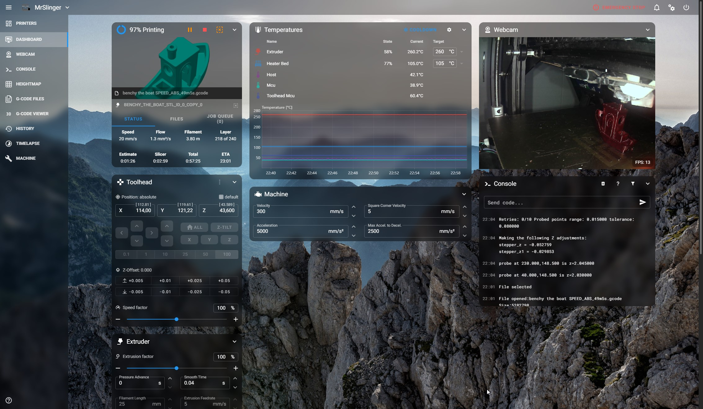

# acryl-fluidd-mainsail-theme
> A Modern Theme for [Fluidd](https://github.com/fluidd-core/fluidd) AND [Mainsail](https://github.com/mainsail-crew/mainsail)



## Installation Mainsail
```bash
git clone https://github.com/eliteSchwein/acryl-fluidd-mainsail-theme ~/klipper_config/.theme
```

## Installation Fluidd
```bash
git clone https://github.com/eliteSchwein/acryl-fluidd-mainsail-theme ~/klipper_config/.fluidd-theme
```

## Update Mainsail
```bash
git -C ~/klipper_config/.theme pull
```

## Update Fluidd 
```bash
git -C ~/klipper_config/.fluidd-theme pull
```

## License
[MIT License](./LICENSE)

## Credits
* [steadyjaw](https://github.com/steadyjaw) for the README Base 
